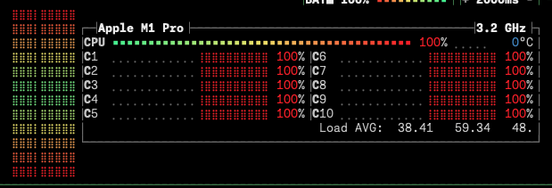
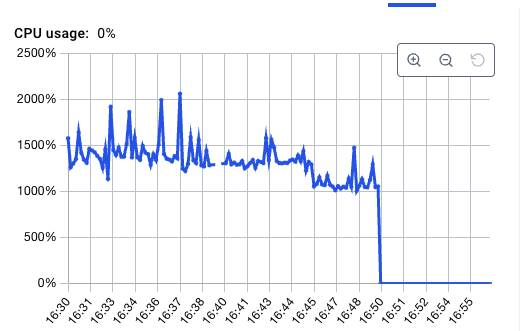
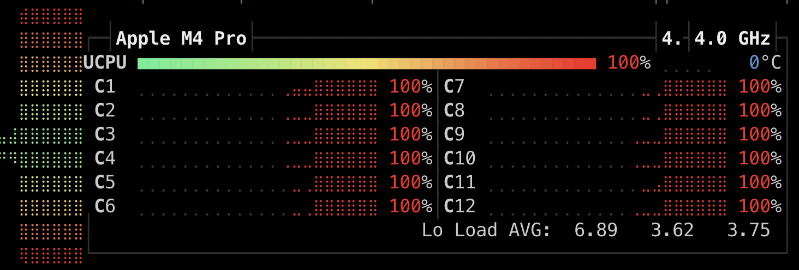
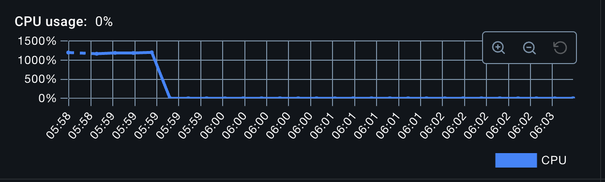

# FAAFO Go cli
In the spirit of FAAFO (fuck around and find out), I created this small CLI app as part of a hacking hour with [tamirarnesty](https://github.com/tamirarnesty). The POC we were trying to build here is validating an OpenAPI json document.

## How to run the app
1. Set up the model in docker locally `make ollama-up`
3. Run the app `make up`

# Tests (if you want to call it that)
The output file can be viewed in `files/output-fix.json`. You can also install `git-delta` and run the command:
```
delta files/sample-api.json files/output-fix.json
```

### M1 MacBook Pro with 32GB RAM
Well the first run went as you would expect. I may have failed to convince Tamir to join the LocalLLaMA movement.


And after peaking at 2000% CPU with all cores fired up, it just died after 20 minutes.


### M4 MacBook Pro with 24GB RAM (runtime: ~1.5 minutes)
Under the same conditions as test 1, it ran in under a minute with all cylinders firing with the initial prompt. After some "prompt engineering", the runtime was 1.5 minutes.



## Bill of Materials
1. Official OpenAI go client
2. Ollama official docker image
3. llama3.2 3b model
