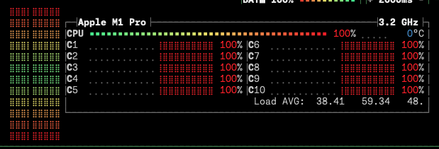
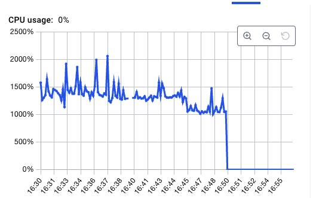

# FAAFO Go cli
In the spirit of FAAFO (fuck around and find out), I created this small CLI app as part of a hacking hour with [tamirarnesty](https://github.com/tamirarnesty). The POC we were trying to build here is validating an OpenAPI json document.

## How to run the app
1. Bring up docker `docker compose up -d`
2. Pull the specific model `docker exec -it ai-project-ollama-1 ollama pull llama3.2`
3. Run the app `go run main.go`

Well the first run on my work MacBook M1 Pro with 32GB Ram, went as you would expect. I may have failed to convince Tamir to join the LocalLLaMA movement.

And after peaking at 2000% CPU it just died after 20 minutes.

## Bill of Materials
1. Official OpenAI go client
2. Ollama official docker image
3. llama3.2 3b model
